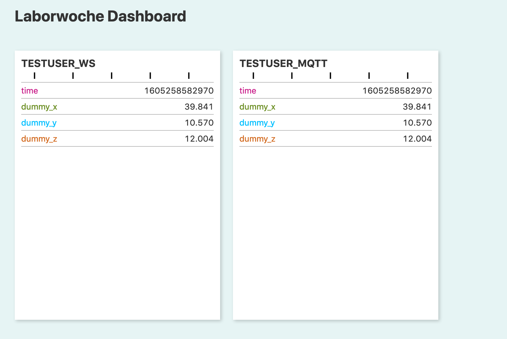
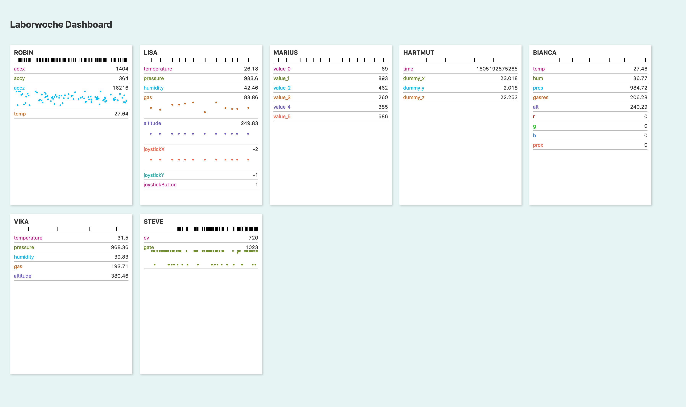

### Laborwoche 11/2020 at HfG Schwäbisch Gmünd

# Visualization of Live Sensor Data

During the workshop I (Hartmut Bohnacker) had also a little time to play around. Because I didn't plug my own Arduino to get sensor data, we asked everybody in the workshop to send their data through an mqtt server. This way I could collect all that data to put it on a dashboard.

The dashboard is made using [Svelte](https://svelte.dev/). It already works somehow but has gotten a bit messy in terms of data handling.

## Installation

1. Make sure you have Node.js and Node-Red installed.
2. Run Node-Red and import the flows supplied in this directory and deploy.
3. Install the node project with ```npm install``` and run it with ```npm run dev```

When you open the site in the browser you should see something like this:


During the workshop there was a bit more to see:


