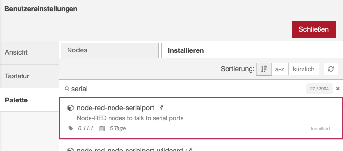
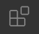

# Live Data Visualization

Laborwoche WS20/21 

**Kursleiter:**
Luca Stetter
Prof. Hartmut Bohnacker

## SetUp

### Node SetUp

#### 1. install NodeJS

1. go to the [NodeJS Website](https://nodejs.org/en/)
2. download LTS version
3. open Terminal
4. check with: ```node -v```


#### 2. install Node-Red

1. stay in Terminal
2. terminal: ```sudo npm install -g --unsafe-perm node-red```
3. terminal: ```node-red```
4. Serveradresse in Browser öffnen:
    ```[info] Server wird jetzt auf http://127.0.0.1:1880/ ausgeführt.```

#### 3. add Node-Red Modules

1. Menü > Palette verwalten
2. *node-red-node-serialport* installieren


### IDE SetUp

#### 1. Install Visual Studio Code

1. go to [VS Code Website](https://code.visualstudio.com/)
2. download

#### 2. SetUp VS Code

1. open VS Code
2. go to the Extensions Tab  on the left
3. install *Live Server*
4. install *Live Share*
5. Log In with your Github Account